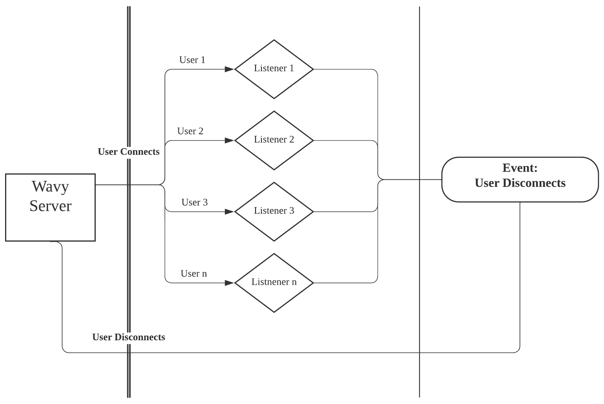
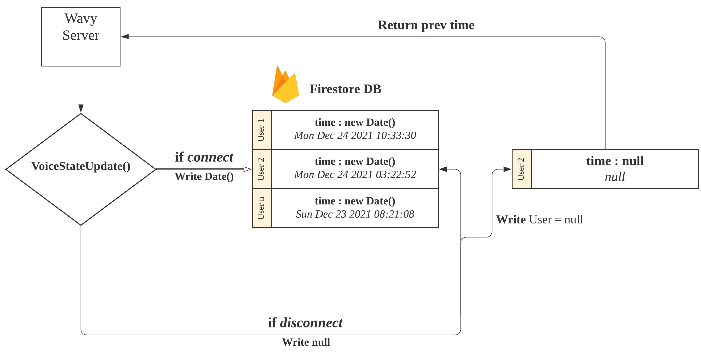
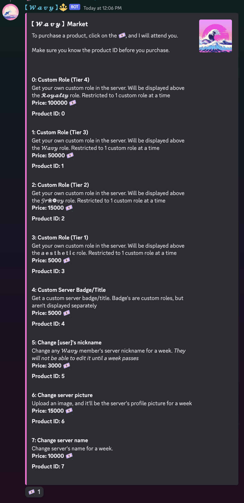
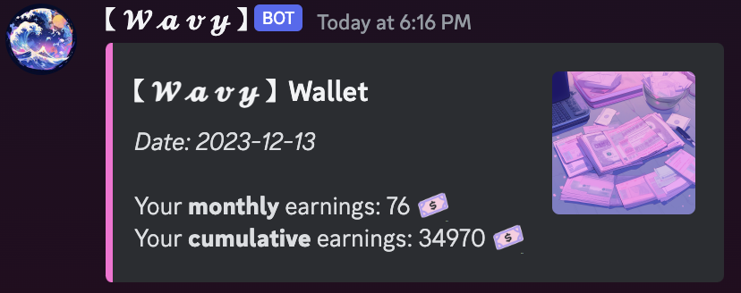
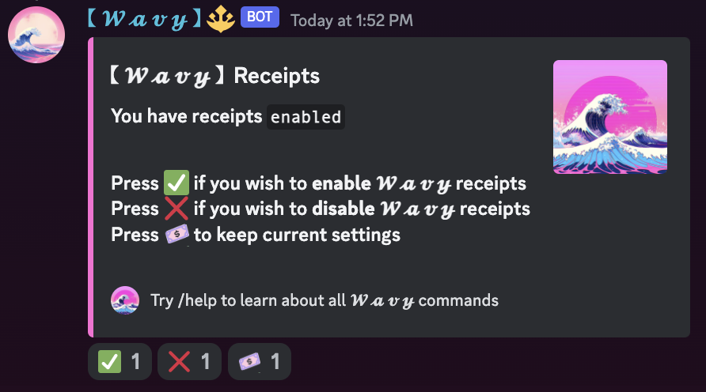

<h1 align="center">
   
  
   
  【 𝓦 𝓪 𝓿 𝔂 】
   
</h1>

<h4 align="center">Ｃｕｒｒｅｎｃｙ， Ｍｕｓｉｃ， Ｍｏｄｅｒａｔｉｏｎ</h4>

  
  
  
  

  <a href="#overview">Overview</a>
  •
  <a href="#installation">Installation</a>
  •
  <a href="#features">Features</a>
  •
  <a href="#join-the-community">Community</a>
  •
  <a href="#license">License</a>

# Overview
【 𝓦 𝓪 𝓿 𝔂 】 ｉｓ ｙｏｕｒ ｌｏｃａｌ ｖａｐｏｒｗａｖｅ ａｓｓｉｓｔａｎｔ

- 𝓒𝓾𝓻𝓻𝓮𝓷𝓬𝔂 : Earn Wavy Bucks for your time and contribution
- 𝓜𝓪𝓻𝓴𝓮𝓽 : Exchange in-server perks (badges, roles)
- 𝓡𝓪𝓯𝓯𝓵𝓮𝓼 : Exchange real-world perks (giftcards, coupons)
- 𝓒𝓪𝓼𝓲𝓷𝓸 : Gamble away against 𝓦 𝓪 𝓿 𝔂 members or the house
- 𝓜𝓾𝓼𝓲𝓬 : Hand-selected and curated 𝓦 𝓪 𝓿 𝔂 lo-fi radio
- 𝓡𝓮𝓬𝓮𝓲𝓹𝓽 : Track all your earnings and spendings

# Installation
**【 𝓦 𝓪 𝓿 𝔂 】 is currently privately shared**

Shoot me a DM `@Baegi#4444` if you're interested!

# Features
### 𝓒𝓾𝓻𝓻𝓮𝓷𝓬𝔂
  
Unlike other *Economy/Currency* Discord bots, 【 𝓦 𝓪 𝓿 𝔂 】 rewards users by **time spent** in voice channels. Thus, more active members earn significantly more.  
A major consideration was the amount of theoretical traffic when users are active all at once. The original approach (assigning a dedicated listener to every user) quickly became a problem as the userbase increased:

<figure style="display: flex;">
  
  
Time: $O(n)$ Space: $O(n)$

  <figcaption>
</figure> 

Although JS's native asynchronous feature made for a simple and easy to implement solution, given $n\ =\ users$, time/space complexity of $O(n)$ could be improved. To address said issue:

<figure style="display: flex;">
  
  
Time: $O(1)$ Space: $O(n)$

  <figcaption>
</figure> 

An external database (*Firestore*) and Discord's *voiceStateUpdate()* feature allowed for a single, centralized listener to handle all voice channel connects and disconnects. Thus, improving time complexity to $O(1)$, and significantly reducing the size of stored data from Event Listeners to a Date object. 

𝓒𝓾𝓻𝓻𝓮𝓷𝓬𝔂 calculation is performed while considering '**inflation**' across all servers: 
$$Earnings\ Per\ User\ (EPU) = \dfrac{∀earnings\ +\ ∀spendings}{total\ number\ of\ users}$$
$$Consumer\ Price\ Index\ (CPI) = \dfrac{EPU(∀servers)\ -\ EPU(server\ x)}{EPU(server\ x)}\ + \ 1$$
$$if\ CPI\ < 0,\ CPI = 0$$
$$Currency = \Big\lfloor \dfrac{(time\ disconnected\ -\ time\ connected) * CPI}{rate}\Big\rfloor$$
$rate$ *is base of 5, increased to 3 for server boosters*  
**TL;DR: all users in servers with less activity will earn more coins**

### 𝓜𝓪𝓻𝓴𝓮𝓽, `/market` `/edit`

  

  

    <h1>𝓜𝓪𝓻𝓴𝓮𝓽</h1>
    
Upon typing <b>/market</b>, users are given a table of in-server perks available in the respective server. All perks stored in a separate database bucket, and payments are calculated with <b>cumulative</b> currency.

  

### 𝓡𝓪𝓯𝓯𝓵𝓮𝓼, `/raffle`

### 𝓒𝓪𝓼𝓲𝓷𝓸, `/casino`

### 𝓜𝓾𝓼𝓲𝓬, `/music`
 
Youtube, Spotify, and other music streaming platforms have been actively shutting down Discord bots with music features. To avoid copyright offenses, 【 𝓦 𝓪 𝓿 𝔂 】 `/music` feature will play a 24/7 curated lo-fi radio at your current voice channel.

### 𝓡𝓮𝓬𝓮𝓲𝓹𝓽, `/wallet` `/receipt`
 

`/wallet`, when used, DMs the user a simple message with monthly + cumulative earnings 

`/receipt`, gives users the ability to turn on/off automatic receipts after a voice channel session  

# Join the community!

# License

Artwork created by [Midjourney AI](https://www.midjourney.com/explore).

Released under the [MIT](LICENSE) license.
