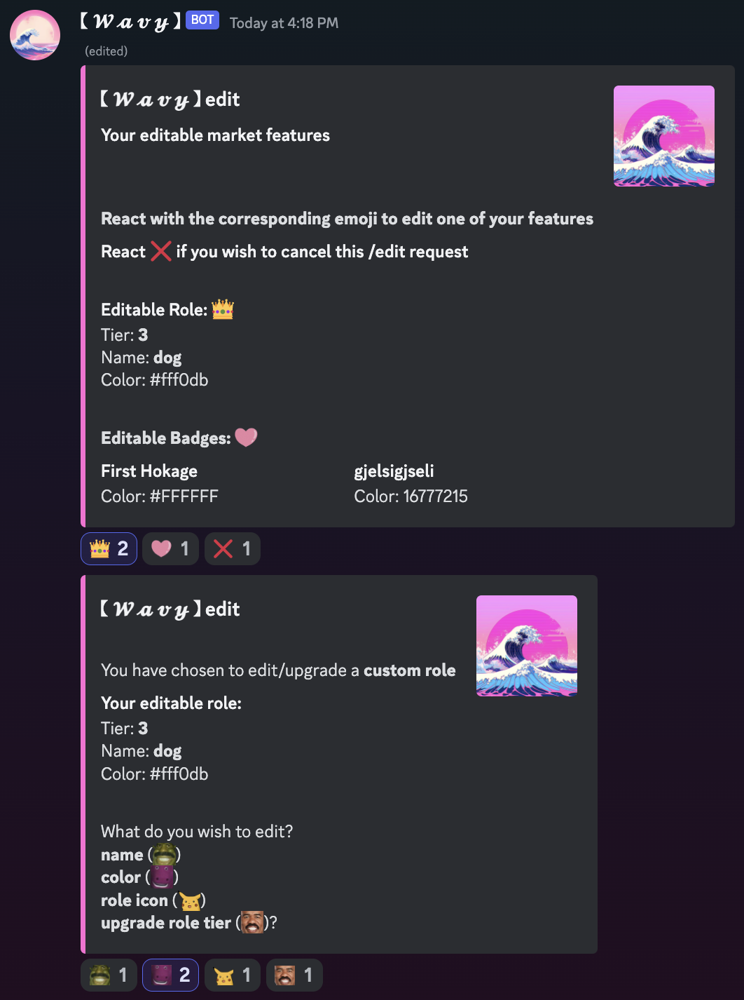
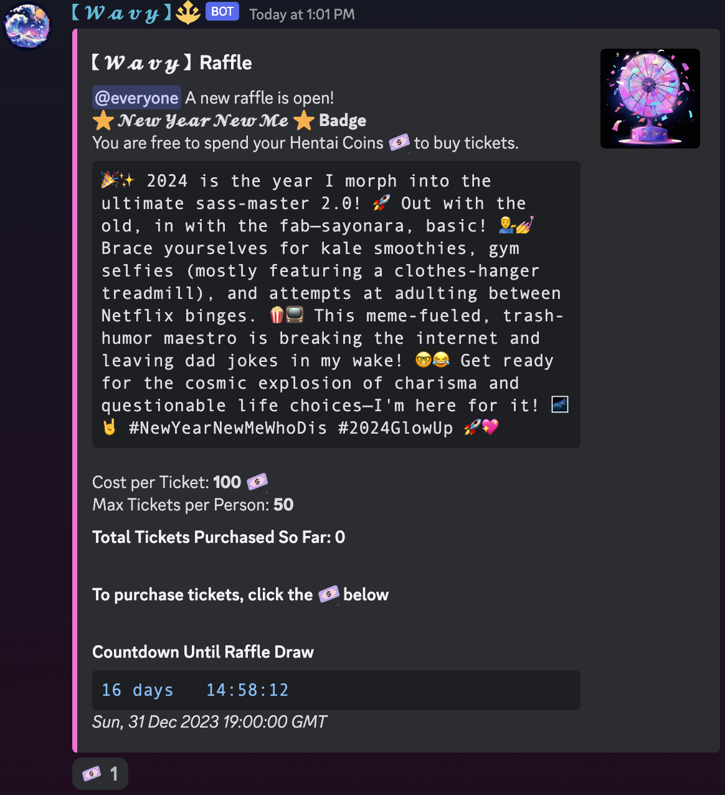
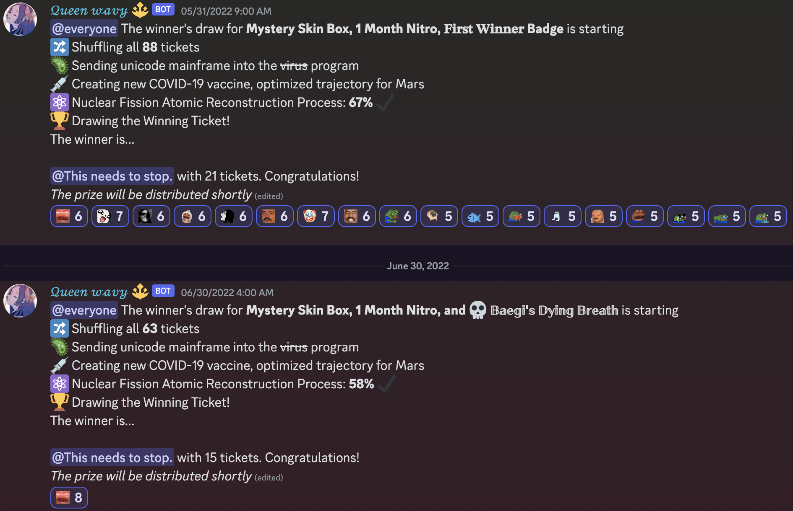
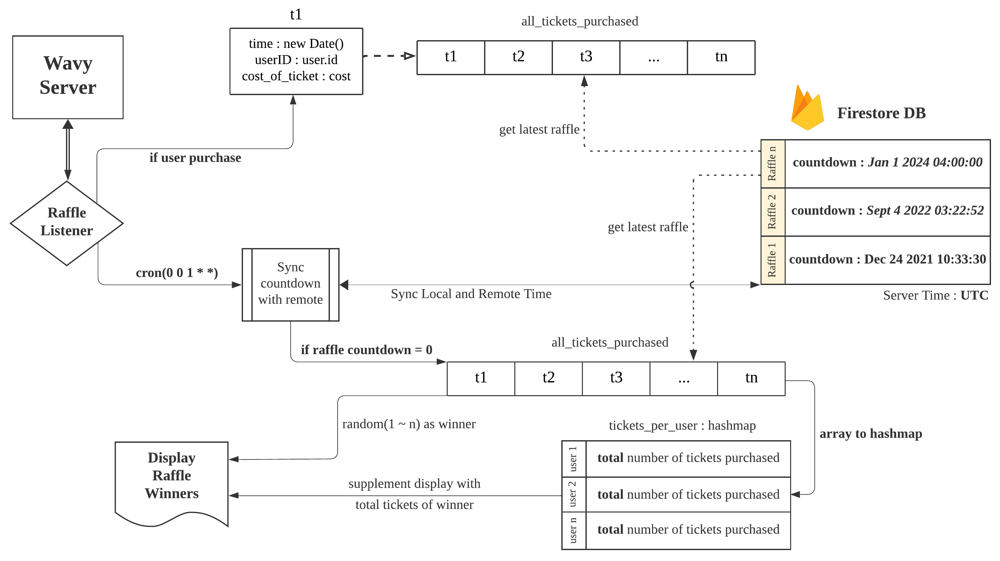
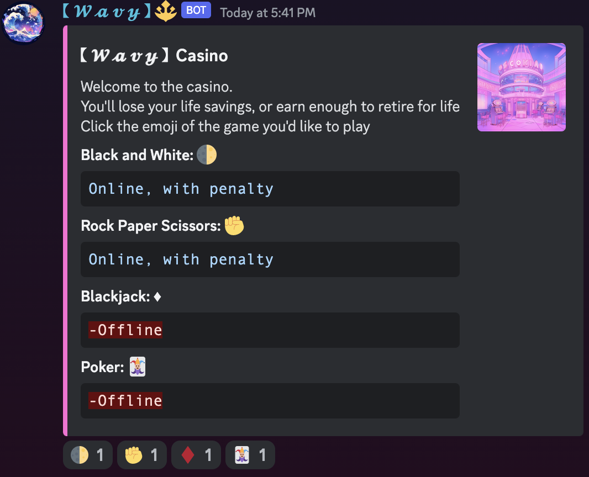
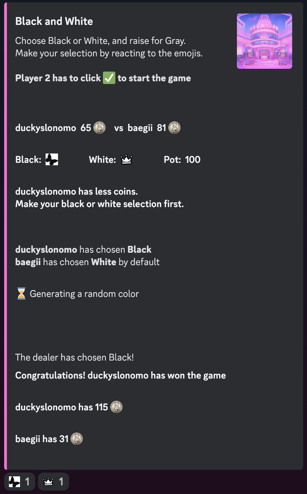

<h1 align="center">
   
  
   
  【 𝓦 𝓪 𝓿 𝔂 】
   
</h1>

<h4 align="center">Ｃｕｒｒｅｎｃｙ， Ｍｕｓｉｃ， Ｍｏｄｅｒａｔｉｏｎ</h4>

  
  
  
  
  

  <a href="#overview">Overview</a>
  •
  <a href="#installation">Installation</a>
  •
  <a href="#features">Features</a>
  •
  <a href="#history">History</a>
  •
  <a href="#license">License</a>

# Overview
【 𝓦 𝓪 𝓿 𝔂 】 ｉｓ ｙｏｕｒ ｌｏｃａｌ ｖａｐｏｒｗａｖｅ ａｓｓｉｓｔａｎｔ

- 𝓒𝓾𝓻𝓻𝓮𝓷𝓬𝔂 : Earn Wavy Bucks for your time and contribution
- 𝓜𝓪𝓻𝓴𝓮𝓽 : Exchange in-server perks (badges, roles)
- 𝓡𝓪𝓯𝓯𝓵𝓮𝓼 : Exchange real-world perks (giftcards, coupons)
- 𝓒𝓪𝓼𝓲𝓷𝓸 : Gamble away against 𝓦 𝓪 𝓿 𝔂 members or the house
- 𝓜𝓾𝓼𝓲𝓬 : Hand-selected and curated 𝓦 𝓪 𝓿 𝔂 lo-fi radio
- 𝓡𝓮𝓬𝓮𝓲𝓹𝓽 : Track all your earnings and spendings

# Installation
**【 𝓦 𝓪 𝓿 𝔂 】 is currently privately shared**

Shoot me a DM `@baegii` if you're interested!

# Features
## 𝓒𝓾𝓻𝓻𝓮𝓷𝓬𝔂
  
Unlike other *Economy/Currency* Discord bots, 【 𝓦 𝓪 𝓿 𝔂 】 rewards users by **time spent** in voice channels. Thus, more active members earn significantly more.  
A major consideration was the amount of theoretical traffic when users are active all at once. The original approach (assigning a dedicated listener to every user) quickly became a problem as the userbase increased:

<figure style="display: flex;">
  
  
Time: $O(n)$ Space: $O(n)$

  <figcaption>
</figure> 

Although JS's native asynchronous feature made for a simple and easy to implement solution, given $n\ =\ users$, time/space complexity of $O(n)$ could be improved. To address said issue:

<figure style="display: flex;">
  
  
Time: $O(1)$ Space: $O(n)$

  <figcaption>
</figure> 

An external database (*Firestore*) and Discord's *voiceStateUpdate()* feature allowed for a single, centralized listener to handle all voice channel connects and disconnects. Thus, improving time complexity to $O(1)$, and significantly reducing the size of stored data from Event Listeners to a Date object. 

𝓒𝓾𝓻𝓻𝓮𝓷𝓬𝔂 calculation is performed while considering '**inflation**' across all servers: 
$$Earnings\ Per\ User\ (EPU) = \dfrac{∀earnings\ +\ ∀spendings}{total\ number\ of\ users}$$
$$Consumer\ Price\ Index\ (CPI) = \dfrac{EPU(∀servers)\ -\ EPU(server\ x)}{EPU(server\ x)}\ + \ 1$$
$$if\ CPI\ < 0,\ CPI = 0$$
$$Currency = \Big\lfloor \dfrac{(time\ disconnected\ -\ time\ connected) * CPI}{rate}\Big\rfloor$$
$rate$ *is base of 5, increased to 3 for server boosters*  
**TL;DR: all users in servers with less activity will earn more coins**

## 𝓜𝓪𝓻𝓴𝓮𝓽: `/market` `/edit`

<table>
  <tr>
    <td></td>
    <td>
      

        
/𝓜𝓪𝓻𝓴𝓮𝓽

        
Upon typing <b>/market</b>, users are given a table of in-server perks available in the respective server. All perks stored in a separate database bucket, and payments are calculated with <b>cumulative</b> currency.

      

    </td>
  </tr>
  <tr>
    <td></td>
    <td>
      

        
<b>/edit</b>

        
<b>/edit</b> provides users a streamlined way to change and/or upgrade their in-server perks from 𝓜𝓪𝓻𝓴𝓮𝓽. The menu of available perks to edit is dynamically displayed based on the user and their server.

      

    </td>
  </tr>
</table>

## 𝓡𝓪𝓯𝓯𝓵𝓮𝓼: `/raffle`

<table>
  <tr>
    <td></td>
    <td>
      

        
/𝓡𝓪𝓯𝓯𝓵𝓮

        
Upon typing <b>/raffle</b>, users are given the latest available raffle in the respective server. Similar to market, all raffles are stored in a separate database bucket, but payments are calculated with <b>monthly</b> currency.

      

    </td>
  </tr>
</table>

### Examples of Raffle Winners

Here's a few examples of how the bot behaves when the countdown of a raffle finishes. 
Raffle draws have to consider two things:  
1. Every individual ticket purchased has to be kept track of (for transaction logging)
2. Number of tickets purchased should directly affect probability of winning 

 
#### `all_tickets_purchased`
An array that represents every ticket purchased by every user. Whenever a user purchases tickets, said array is the only bucket that is updated. Thus, read/write is guaranteed to remain at 1 with every update. 
#### Local and Remote Timezones
𝓡𝓪𝓯𝓯𝓵𝓮𝓼 has a safeguard against timezone differences of development and remote environments. Although unlikely, if 【 𝓦 𝓪 𝓿 𝔂 】 were to be deployed remotely for development, it can **potentially** cause unwanted behavior in raffles if countdown is considered to have reached 0 locally. Thus, raffle's centralized listener is often synced with Firebase's **UTC** time.
#### Draw Calculation
𝓡𝓪𝓯𝓯𝓵𝓮 follows a simple **weighted** draw equation (weighted dice problem):  
$$P(i) = \dfrac{w_i}{\Sigma_{j=1}^n w_j}$$
where $P(i)$ is the winning probability of a given user, and $w$ is the weight based on total number of tickets purchased.
## 𝓒𝓪𝓼𝓲𝓷𝓸: `/casino`

<table>
  <tr>
    <td></td>
    <td>
      

        
/𝓒𝓪𝓼𝓲𝓷𝓸

        
Upon typing <b>/casino</b>, users are given a selection of available mini games in the respective server. All perks stored in a separate database bucket, and payments are calculated with <b>cumulative</b> currency.

      

    </td>
  </tr>
  <tr>
    <td></td>
    <td>
      

        
Black and White

        
The simplest game available in <u><b>all servers by default</b></u> is <i>Black and White</i>. The image to the left is an example run of the game. The user with less coins selects Black/White, and the house selects either Black/White/Gray. User who selected the same as the house wins the pot, Gray doubles the pot and restarts the round.

      

    </td>
  </tr>
</table>

## 𝓜𝓾𝓼𝓲𝓬: `/music`
 
Youtube, Spotify, and other music streaming platforms have been actively shutting down Discord bots with music features. To avoid copyright offenses, 【 𝓦 𝓪 𝓿 𝔂 】 `/music` feature only plays a 24/7 curated lo-fi radio at your current voice channel.

## 𝓡𝓮𝓬𝓮𝓲𝓹𝓽: `/wallet` `/receipt`
 

<table>
  <tr>
    <td></td>
    <td>
      

        
/wallet

        
DMs the user a simple message with monthly + cumulative earnings

      

    </td>
  </tr>
  <tr>
    <td></td>
    <td>
      

        
<b>/receipt</b>

        
Gives users the ability to turn on/off automatic receipts after a voice channel session

      

    </td>
  </tr>
</table>

# History

【 𝓦 𝓪 𝓿 𝔂 】's various features used to be handled by two different bots since early 2021. 
Due to Discord API updates, and ease of distribution, support of old bots have been discontinued.

# License

Artwork created by [Midjourney AI](https://www.midjourney.com/explore).

Released under the [MIT](LICENSE) license.
