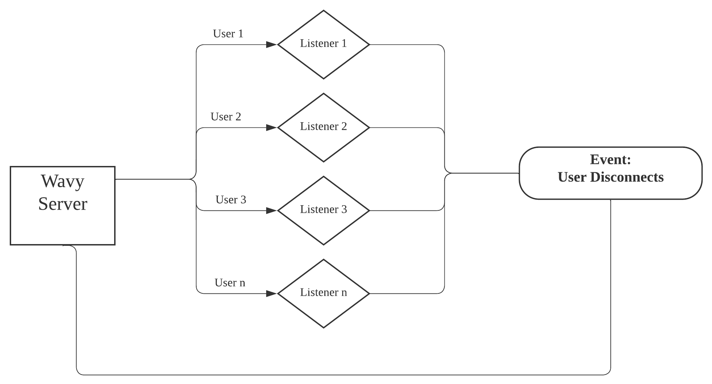

<h1 align="center">
   
  
   
  【 𝓦 𝓪 𝓿 𝔂 】
   
</h1>

<h4 align="center">Ｃｕｒｒｅｎｃｙ， Ｍｕｓｉｃ， Ｍｏｄｅｒａｔｉｏｎ</h4>

  
  
  
  

  <a href="#overview">Overview</a>
  •
  <a href="#installation">Installation</a>
  •
  <a href="#features">Features</a>
  •
  <a href="#join-the-community">Community</a>
  •
  <a href="#license">License</a>

# Overview
【 𝓦 𝓪 𝓿 𝔂 】 ｉｓ ｙｏｕｒ ｌｏｃａｌ ｖａｐｏｒｗａｖｅ ａｓｓｉｓｔａｎｔ

- 𝓒𝓾𝓻𝓻𝓮𝓷𝓬𝔂 : Earn Wavy Bucks for your time and contribution
- 𝓜𝓪𝓻𝓴𝓮𝓽 : Exchange in-server perks (badges, roles)
- 𝓡𝓪𝓯𝓯𝓵𝓮𝓼 : Exchange real-world perks (giftcards, coupons)
- 𝓒𝓪𝓼𝓲𝓷𝓸 : Gamble away against 𝓦 𝓪 𝓿 𝔂 members or the house
- 𝓜𝓾𝓼𝓲𝓬 : Hand-selected and curated 𝓦 𝓪 𝓿 𝔂 lo-fi radio
- 𝓡𝓮𝓬𝓮𝓲𝓹𝓽 : Track all your earnings and spendings

# Installation
**【 𝓦 𝓪 𝓿 𝔂 】 is currently privately shared**

Soon to be released publicly!

# Features
### 𝓒𝓾𝓻𝓻𝓮𝓷𝓬𝔂
 
Unlike other *Economy/Currency* Discord bots, 〠𓦠𓪠𓿠𔂠】 rewards users by **time spent** in voice channels. Thus, more active members earn significantly more.  
A major consideration was the amount of theoretical traffic when users are active all at once. The original approach (assigning a dedicated listener to every user) quickly became a problem as the userbase increased:  

<figure style="display: flex;">
  
  
Time: O(n) Space: O(n)

  <figcaption>
</figure> 

Although JS's native asynchronous feature made for a simple and easy to implement solution, given users = n, time/space complexity of O(n) could be improved. To address said issue:

<figure style="display: flex;">
  
  
Time: O(1) Space: O(n)

  <figcaption>
</figure> 

An external database (Firestore) and Discord's voiceStateUpdate() feature allowed for a single, centralized listener to handle all voice channel connects and disconnects. Thus, improving time complexity to O(1), and significantly reducing the size of stored data from Event Listeners to a Date object.  

𝓒𝓾𝓻𝓻𝓮𝓷𝓬𝔂 calculation is performed while considering **inflation** across all servers: 
$$Earnings\ Per\ User\ (EPU) = \dfrac{∀earnings\ +\ ∀spendings}{total\ number\ of\ users}$$
$$CPI = \dfrac{EPU(∀servers)\ -\ EPU(server\ x)}{EPU(server\ x)}\ + \ 1$$
$$if\ CPI\ < 0,\ CPI = 0$$
$$Currency = \Big\lfloor \dfrac{(time\ connected\ -\ time\ disconnected) * CPI}{rate * 1000}\Big\rfloor$$

$rate$ is base of 5, increased to 3 for server boosters

### 𝓜𝓪𝓻𝓴𝓮𝓽

### 𝓡𝓪𝓯𝓯𝓵𝓮𝓼

### 𝓒𝓪𝓼𝓲𝓷𝓸

### 𝓜𝓾𝓼𝓲𝓬 

### 𝓡𝓮𝓬𝓮𝓲𝓹𝓽

# Join the community!

# License

Artwork created by [Midjourney AI](https://www.midjourney.com/explore).

Released under the [MIT](LICENSE) license.
